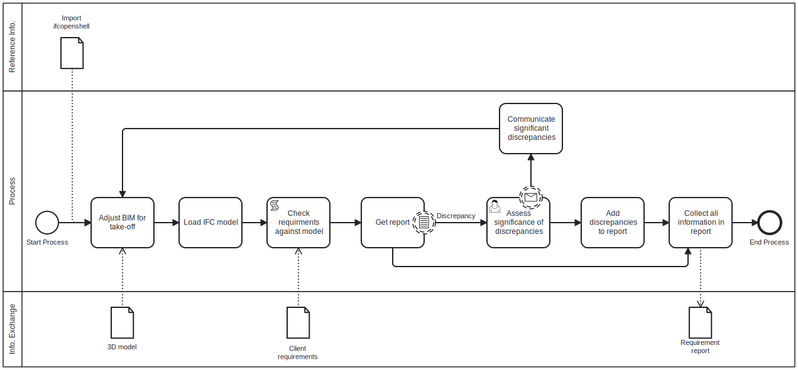
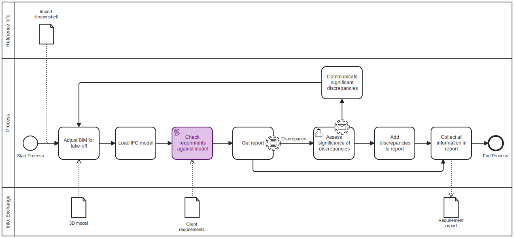
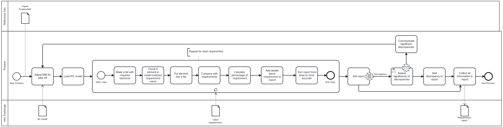

## Assignment A2: Use case
### A2a: About your group
Nikolas claims 2 as score, and Freya claims 3 as score giving us a total score of 5.

Our focus area is BUILD, and we are analysts. Our focus area are keeping the  manager role.

### A2b: Identify Claim
We are working with building #2508.

Claim:
- Check the clients room requirements against the IFC model.

Justification:
- Quality ensurance: Make sure the client's requirments are satisfied.

### A2c: Use Case

* **How** you would check this claim?
    - Go through the IFC model with a code, make lists with different room types and then sum it up in a report.
* When would this claim need to be checked?
    - During the design and modeling phases, should be used continually through the process to ensure continuous compliance with client requirements.
* What information does this claim rely on?
    - Client requirements
    - Model needs to contain the proper information.
        - All rooms are assigned a space
        - All spaces are named correctly
        - All spaces are assigned NetFloorArea
* What **phase**? planning, design, build or operation.
    - Design
* What BIM **purpose** is required? Gather, generate, analyse, communicate or realise?
    - Gather: (Quantify)
    - Analyse: Validate (Coordinate)
    - Communicate: Document (Visualize)
* Review [use case] examples - do any of these help?, What BIM use case is this closest to? If you cannot find one from the examples, you can make a new one.
    - 06: Design Authoring
    - 07: Design review

### A2d: Scope the use case

### A2e: Tool Idea
Our idea is to make a tool for automating space requirement checks to be used by either the designing part, the client to ensure requirements are met or by others, to quickly compare a model against set space requirements.

The value in this idea lies in the removal of tedium, saving both energy and time by shortening the amount of energy needed to ensure all rooms are accounted for in a model. 

### A2f: Information Requirements
Needed information and where to find it:
- Spaces - assigned to a floor, can be pulled from model with .by_type("IfcSpace").
- Room name - Found under 'Object Information', we will be needing the .LongName to extract the room name.
- Area of room - Found under Quantity Sets in Qto_SpaceBaseQuantities as NetFloorArea.

### A2g: Identify appropriate software licence
MIT License allows for the software to be used freely, only conditions are license and copyright notice. Further we do not leave ourselves open to liability or warranty.
